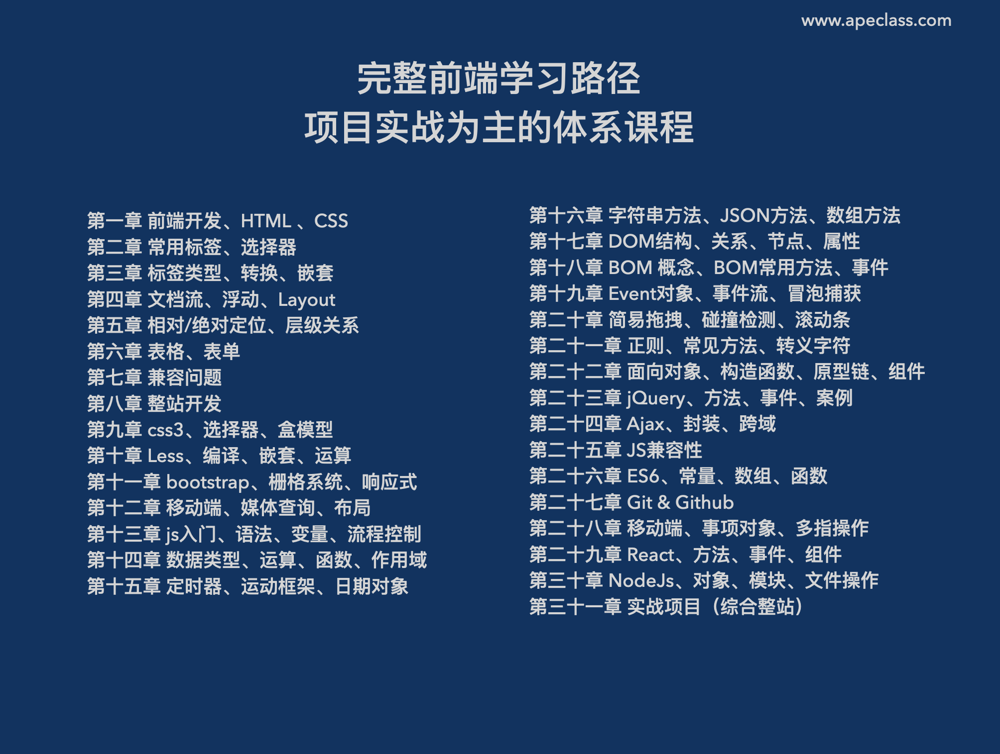
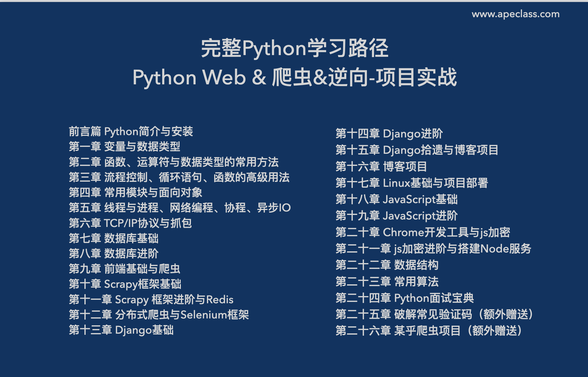
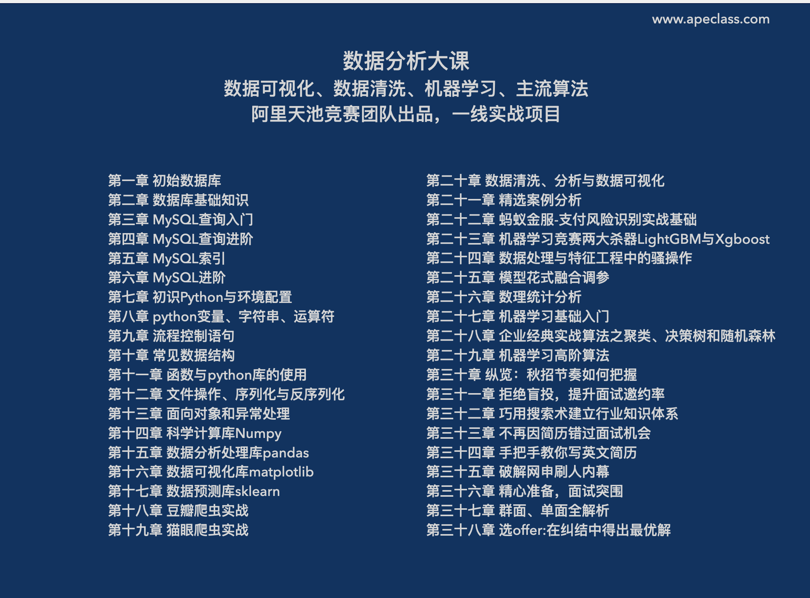
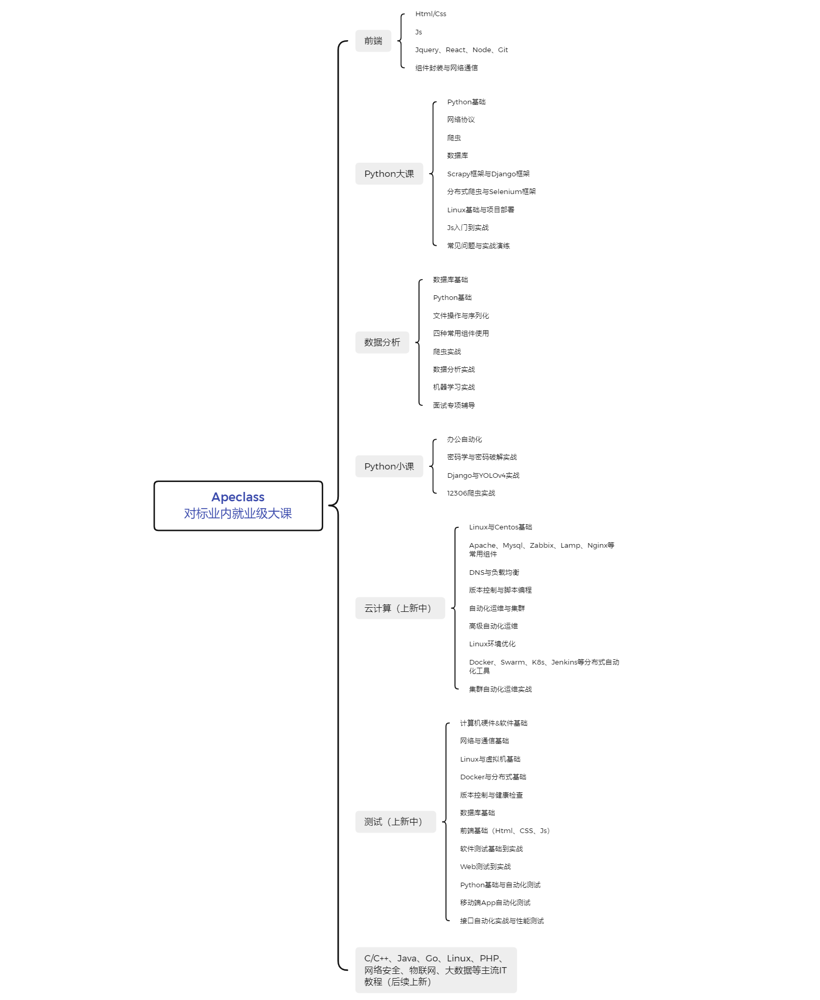

# 关于我们

### Hi:

这里是Apeclass，致力于打造一个人人都学的起的IT课程平台；目前网站上已有《前端大课》、《Python小课》、《Python大课》、《数据分析大课》以供学习。后面会陆陆续续上线更多课程，如：测试、云计算、java、C语言、大数据等等主流学科；

我们上线的课程多为大课，所谓大课，简言之即是同行业其他教育机构对外出售的超过8000元，甚至10000元的课程。此类课程有以下特点：
**1. 售价高昂**
**2. 课程为就业级水准课程**
**3. 课程内容有深度且事无巨细**
**4. 体系的从0到1的课程，小白也适用**

以上是我们常说的“大课”，也是业内提供的标准化就业级课程；

另外，我们的课程为正版授权，多数是来自教育机构或个人讲师。购买版权的费用非常高昂，并且因为需要持续上新更多课程。这也是我们的会员价格一直在持续上涨的主要原因。

#### 学习路线

以下，是部分课程学习路线，我们也会陆续上新更多课程（java、php、Go、云计算、测试等），学习路线会同步更新！

#### 关于会员：

本站目前仅有“百年会员”这一选项，这跟你们在其他平台看到的“永久会员”、“终身会员”是一个意思；可能这一表达会更有意思一些

那么，真的能到一百年吗？

那行，这总比我卖给你1年会员好吧？就算卖1年会员，价格其实也一样的。

#### 会员权益：

**1. 会员可以学习平台上所有课程**
**2. 包括未来上线的新课程，也能学习**
**3. 会员为一次性收费，没有二次收费**
**4. 会员有效期为100年**
**5. 不限设备、不限时间、不限地域（境外ip不行）**

#### 会员价格

目前会员售价为 299.5元
已上涨过4次，随时还会涨价，预购从速

